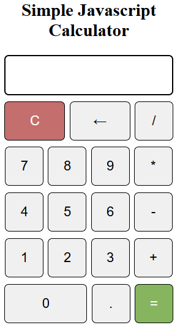

# Simple JavaScript Calculator

A basic calculator built with HTML, CSS, and JavaScript. This project demonstrates fundamental web development skills and provides a functional calculator that can perform basic arithmetic operations.

## Features
- **Basic Arithmetic Operations**: Supports addition, subtraction, multiplication, and division.
- **Responsive Design**: The calculator is responsive and works well on different screen sizes.
- **Keyboard Support**: Allows users to input numbers and operations using the keyboard.
- **Clear and Backspace Functions**: Includes buttons to clear the display and remove the last character.
- **Error Handling**: Displays "Error" for invalid inputs and "Undefined" for division by zero.

## Usage
1. Clone the repository:
   ```bash
   git clone https://github.com/rabbirahat/simple-javascript-calculator.git

2. Open index.html in your web browser to use the calculator.   

## Screenshots
